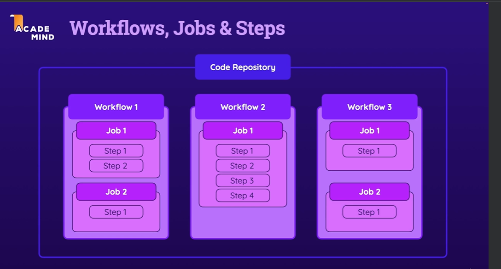
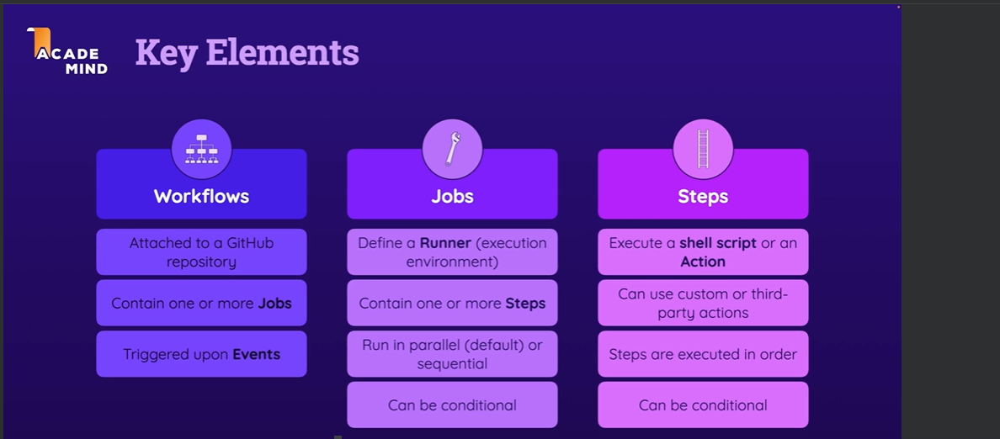

# github_actions information
You have github repository that store code or any kind of project, which workflows attached to that github repository, you can add many workflows as you want to that github repository 

## workflows
depends to the repo and then in that workflow we have one or more jobs
## jobs
- the jobs contain one or more steps, define the runner (execution environment)
- contain one or more steps
- run in parallel or sequential
- can be conditional

## steps
- the actual things that must be done.
- execute a shell script or an action
- can use custome or third party actions
- steps are execute in order
- can be conditional
like:
- download the code
- install dependencies
- run automated test
  

